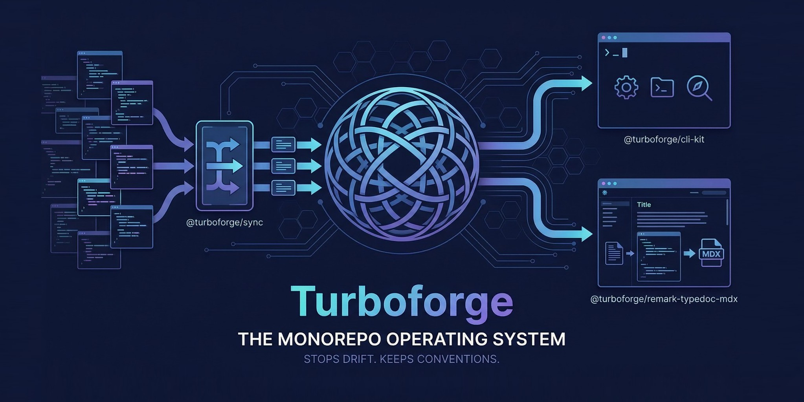

# Turboforge



Turboforge is a monorepo operating system for teams that want strong defaults without freezing their codebase in a starter template.

Most monorepos start clean and get messy fast. Templates drift. Package conventions split. Release tooling forks. Docs become a side project. Turboforge keeps your repo aligned after day one, not just at scaffold time.

## The Problem

Turborepo solves task orchestration. It does not define how your repo should evolve.

Templates solve day-zero setup. They do not help when the template improves next month and your repo has already diverged.

Custom scripts solve immediate problems. They usually become one-off glue that only one person understands.

That leaves most teams with the same failure mode:

- a good starting point
- slow drift across packages
- duplicated CLI logic
- manual upgrade work
- docs and tooling that stop feeling like one system

Turboforge exists to close that gap.

## The Solution

Turboforge gives you a maintainable path from “we have a monorepo” to “we have a coherent engineering system.”

It does that with a focused set of building blocks:

- a sync engine to pull upstream template changes into a real, already-customized repo
- a monorepo-aware CLI foundation for shared config, root detection, and logging
- a docs pipeline to turn API output into MDX that lives alongside your product docs

The goal is not more tooling. The goal is a repo that stays legible as it grows.

## Highlights

- Sync upstream template changes into a repo that already has local decisions.
- Build monorepo-aware CLIs on shared config, root detection, and logging primitives.
- Turn generated TypeDoc output into MDX that fits your docs system.

## Positioning

### One-liner

Turboforge is the layer that keeps your monorepo from drifting apart.

### Who it is for

Turboforge is for teams maintaining a JavaScript or TypeScript monorepo with shared standards, internal tooling, and a need to stay consistent over time.

It is especially useful for:

- OSS maintainers shipping multiple packages from one repo
- startup teams building platform-style monorepos
- developer experience teams standardizing workflows across apps and packages

## Philosophy

### 1. Opinionated beats vague

Good tooling should make tradeoffs on purpose. Turboforge assumes you want conventions, not a blank page.

### 2. Day-two matters more than day-zero

A scaffold is easy. Keeping dozens of packages aligned over time is the real work.

### 3. Composition over lock-in

Each package has a clear job. You can adopt one piece or use the full system.

### 4. Upgrades should be a workflow, not a rewrite

Templates are valuable only if changes can keep flowing downstream.

### 5. Docs are part of the product

Tooling, packages, and documentation should reinforce one another instead of living in separate worlds.

## What You Get

### `@turboforge/sync`

Pull changes from an upstream template into an existing monorepo without pretending your repo is still untouched.

Use it when your template evolves but your repo already has local decisions.

### `@turboforge/cli-kit`

Build monorepo-aware CLIs without rebuilding config loading, root detection, workspace discovery, and logging for every tool.

Use it when you are tired of copying the same CLI primitives across repos.

### `@turboforge/remark-typedoc-mdx`

Convert raw TypeDoc markdown into MDX that fits a modern docs site instead of leaking generator artifacts into production.

Use it when your API docs should feel like part of your product.

Together, these packages describe one idea:

Turboforge helps you keep your monorepo intentional as it grows.

## Quickstart

1. Install dependencies.

```bash
pnpm install
```

2. Explore the packages that make up the system.

```bash
pnpm --filter @turboforge/cli-kit test
pnpm --filter @turboforge/sync test
```

3. Generate docs to see the ecosystem in one place.

```bash
pnpm docs
pnpm --filter @app/web dev
```

4. Start with the package that matches your need:

* repo upgrade workflow: [`packages/forge-sync/README.md`](/c:/Users/G/web/open-source/turbo-forge/packages/forge-sync/README.md)
* internal CLI foundation: [`packages/cli-kit/README.md`](/c:/Users/G/web/open-source/turbo-forge/packages/cli-kit/README.md)
* MDX API docs pipeline: [`packages/remark-typedoc-mdx/README.md`](/c:/Users/G/web/open-source/turbo-forge/packages/remark-typedoc-mdx/README.md)

## Mental Model

Think of Turboforge in three layers:

1. Define a strong repo shape.
2. Keep that shape aligned as the template evolves.
3. Build tooling and docs that inherit the same conventions.

Turboforge does not replace your package manager, task runner, or framework.

It sits above them and answers a different question:

How do we keep this monorepo intentional as it grows?

## What Turboforge Is Not

* Not a Turborepo replacement. Turborepo runs tasks; Turboforge maintains structure.
* Not just a starter. Templates get you started; Turboforge keeps them relevant.
* Not a pile of scripts. The pieces are reusable and form a system.

## Why This Is Different

Most monorepo tooling helps you run work faster.

Turboforge helps you keep that work organized over time.

The hard part of a monorepo is not starting it. It is preventing drift.

## Read Next

* [`packages/forge-sync/README.md`](/c:/Users/G/web/open-source/turbo-forge/packages/forge-sync/README.md)
* [`packages/cli-kit/README.md`](/c:/Users/G/web/open-source/turbo-forge/packages/cli-kit/README.md)
* [`packages/remark-typedoc-mdx/README.md`](/c:/Users/G/web/open-source/turbo-forge/packages/remark-typedoc-mdx/README.md)
